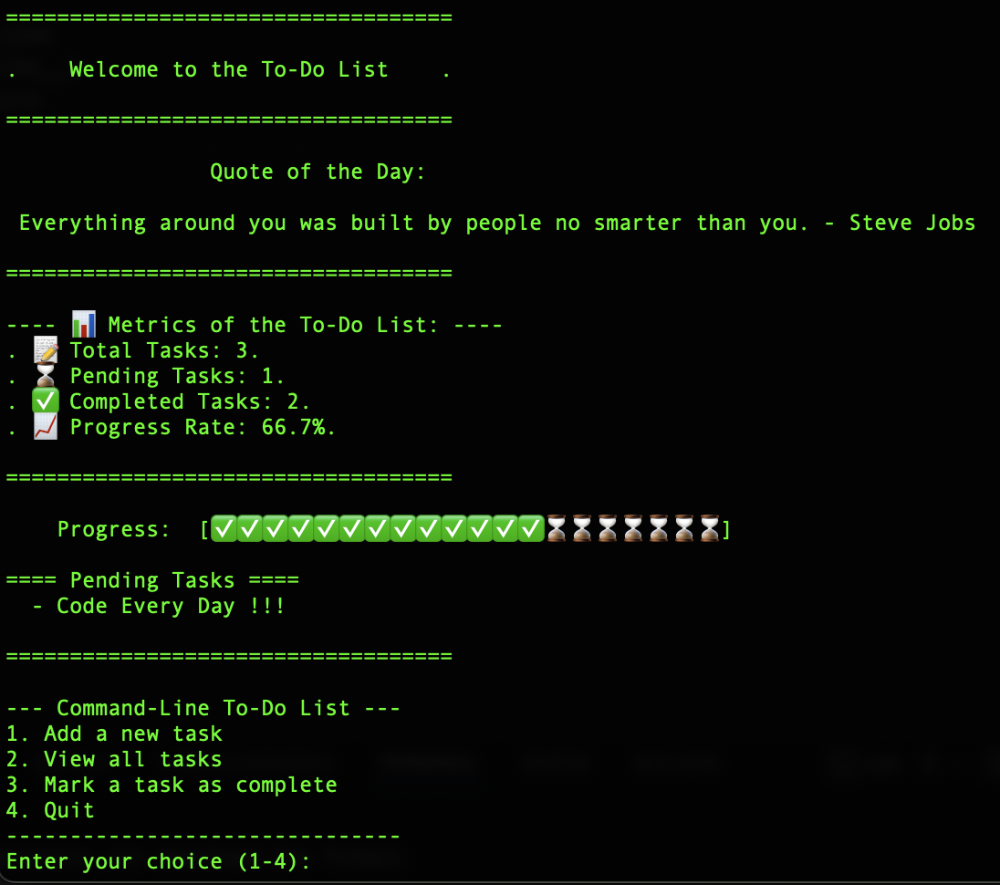

Python CLI To-Do List & Productivity Dashboard

This is a complete, persistent, and automated Command-Line Interface (CLI) application for task management, built from scratch in Python.

It goes beyond a simple to-do list by calculating and displaying a Productivity Dashboard with data-driven metrics, including completion rates and a visual progress bar.

<strong>(Screenshot Here!)</strong>

<i>A demonstration of the app in action.</i>

🚀 Features

Full CRUD Functionality: Create, Read, and Update (mark as complete) tasks.

Data Persistence: All tasks are saved to a tasks.json file, so your data is never lost.

Productivity Dashboard: On launch, the app displays key data science metrics:

Total, Pending, and Completed Task counts.

A proportional, text-based bar graph visualizing your progress.

A list of all currently pending items for a quick review.

Robust Input Handling: The app uses try...except blocks to safely handle user errors (like non-numeric input) without crashing.

Inspiration: Greets you with a random "Quote of the Day" on launch.

(macOS) Automated Startup: Includes a launcher.sh script that can be added to your Mac's Login Items to run the app automatically on startup.

🛠️ How to Run

Clone the repository (or download the files).

Navigate to the project directory:

cd my-python-task-manager

Run the application:

python todo_list.py

💡 Project Purpose & Skills Demonstrated

I built this project to master Python fundamentals and apply core data science concepts in a practical, real-world application.

Python Fundamentals: Functions, loops, if/else logic, and data structures (lists of dictionaries).

Data Persistence: Reading and writing to files using the json library and try...except for error handling.

Data Analysis: Calculating metrics (completion_rate, pending_tasks) from raw data.

Data Filtering: Using a list comprehension to create a filtered list of pending tasks.

Data Visualization: Building a proportional text-based bar graph in the terminal.

Software Design: Structuring the code into distinct sections for Data, Task Management, and UI.
